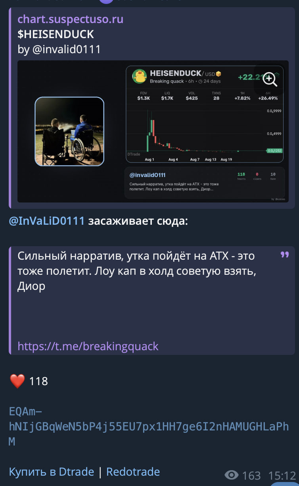

<p align="center">
  <a href="https://t.me/zkprooff"></a>
  <a href="mailto:dev@suspectus.ru"></a>
</p>

# TonCalls

Real-time mirror for TON memecoin calls posted across dozens of Telegram
channels. Watches a curated list of source channels through a userbot, extracts
the token contract (`EQ…`), and republishes each call as an enriched card with
a chart preview, poster reputation counters, referral buttons, and an optional
LLM hot-take.



*(Screenshot from a live deployment: composite preview with chart, source-post
media, poster handle and reaction counters; the quote block and buy links are
appended to the message body.)*

## Layout

```
toncalls/       Userbot + republisher.  Watches source channels via Telethon
                (MTProto), publishes enriched posts via Bot API (buttons) or
                a userbot text link (comments work).
chart-proxy/    HTTP service that serves the OG-preview page and renders the
                composite PNG (chart + avatar + quote + stats) via Pillow.
systemd/        Ready-to-use unit files for prod deployment.
docs/           Screenshots.
```

## Requirements

- Python 3.10+
- A Telegram user account (for the userbot) and a bot (for buttons)
- A public HTTPS-fronted domain for the `chart-proxy` service if you want link
  previews to render
- Optional: a local Ollama or another OpenAI-compatible LLM endpoint

## Setup

```bash
# 1. Clone and configure environment
git clone https://github.com/suspectuso/TonCalls.git
cd TonCalls
cp toncalls/.env.example toncalls/.env
# Edit toncalls/.env — API_ID, API_HASH, BOT_TOKEN, target channels, etc.

# 2. Source channel list
cp toncalls/channels.txt.example toncalls/channels.txt
# Add one @handle per line; the userbot account must already be a member
# of each source channel (join them from your regular Telegram client).

# 3. Optional: your own LLM prompt
cp toncalls/prompts/hot_take.example.txt toncalls/prompts/hot_take.txt
# Edit the text, then set AI_PROMPT_FILE=toncalls/prompts/hot_take.txt in .env

# 4. Install and run the userbot
cd toncalls
python -m venv .venv && .venv/bin/pip install -r requirements.txt
.venv/bin/python main.py

# 5. Install and run chart-proxy (in a separate directory)
cd ../chart-proxy
python -m venv .venv && .venv/bin/pip install -r requirements.txt
.venv/bin/python server.py
# Listens on 127.0.0.1:8090 by default. Front with nginx + Let's Encrypt.
```

On first start the userbot asks for the phone number of the user account and
the confirmation code; both are stored in `<SESSION_NAME>.session`.

## Production

Sample `systemd` units are in `systemd/`. Copy to `/etc/systemd/system/`, set
your `WorkingDirectory` / `EnvironmentFile`, and:

```bash
systemctl enable --now TON              # userbot
systemctl enable --now chart-proxy      # OG preview server
```

For the chart-proxy domain:

```nginx
server {
    listen 443 ssl http2;
    server_name preview.example.com;
    ssl_certificate     /etc/letsencrypt/live/preview.example.com/fullchain.pem;
    ssl_certificate_key /etc/letsencrypt/live/preview.example.com/privkey.pem;
    location / {
        proxy_pass http://127.0.0.1:8090;
        proxy_set_header Host $host;
    }
}
```

Set `CHART_PROXY_DOMAIN=preview.example.com` in `.env` (no trailing slash, no
scheme).

## How it works

1. The userbot subscribes to updates from every source channel and also runs a
   short-interval polling loop as a backstop against Telethon's `UpdatesTooLong`
   gap.
2. Each incoming message is scanned for a TON contract regex
   (`EQ[A-Za-z0-9_-]{40,60}`). Contracts found inside a `tonviewer.com` /
   `tonscan.org` URL are treated as wallets (not tokens) and filtered out.
3. Token metadata is fetched from DexScreener (symbol, MCAP, LIQ, 6h price
   change). If the token has no pairs, the post is treated as a stale or
   wallet-only mention and dropped.
4. The bot posts an enriched card via Bot API to `ENRICHED_TARGET_CHANNEL` with
   an inline "Buy" button and a `link_preview_options.url` pointing at
   `chart-proxy`.
5. If `ENRICHED_DUP_CHANNEL` is set, the userbot also posts a plain-text
   version to that second channel — no button (so replies / comment threads
   look native) but the same preview above the text.
6. Reaction counters (❤️ / 🤡 across the poster's last 50 messages) and a
   duplicate-count for the same CA are cached in SQLite and refreshed
   fire-and-forget on subsequent posts.
7. An optional local LLM (Ollama, LM Studio, …) can be called for a one-line
   comment attached to the enriched post; see `toncalls/prompts/`.

## Configuration reference

All configuration is via environment variables. See
`toncalls/.env.example` for the full list with explanations.

## Related documentation

- MTProto link-preview semantics (`InputMediaWebPage`, `invert_media`,
  `optional`) — this repository's `chart-proxy` relies on all three.
  See the Telethon documentation and the "Bot API 7.0+" changelog for
  `link_preview_options`.
- Bot API 9.4 `style` for coloured inline buttons is used in the enriched-post
  payload.

## License

MIT. See `LICENSE`.

## Contributing

Issues and pull requests welcome. Please strip any private material (bot
tokens, session files, real channel handles) before including logs or example
payloads.


